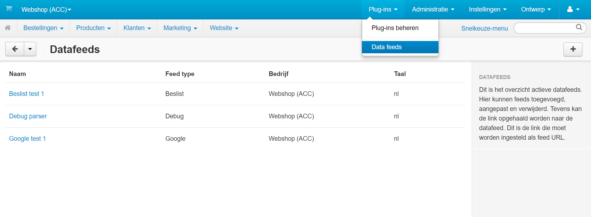
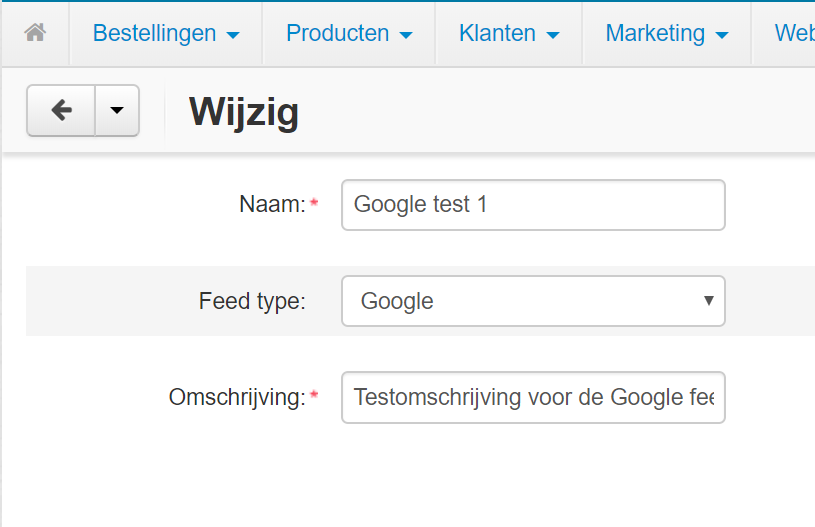
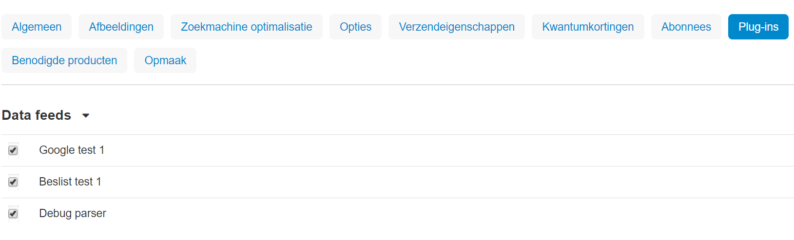

# CsCartFeeds
Data feeds for Cs Cart.
This data feed plugin is not as flexible as many others, but it is way more easy to use.
This plugin lets you add predefined feeds in predefined formats.
(Adding an extra feed requires coding.)

The following feeds have been implemented:
* [Google Shopping (RSS 2.0)](https://support.google.com/merchants/answer/160589) 
* [Daisycon](https://faq-advertiser.daisycon.com/hc/nl/articles/115000721785-Hoe-moet-ik-als-adverteerder-een-productfeed-aanleveren-)
* [Beslist](http://cl.beslist.nl/pdf/Productfeed-handleiding%20voor%20Pro%20Shops%20NL.pdf)
* LeGuide
* [Tweakers](https://docplayer.nl/16731720-Tweakers-pricewatch-specificaties-productfeed.html)
* [Vergelijk](https://www.vergelijk.nl/info/partnerpagina/)
* [Kieskeurig](https://www.kieskeurig.nl/pricefeed)

## General feed settings
Some settings are being shared between feeds.

### Shipment cost per product
Most feeds require shipment cost. The default shipment cost cannot be used.
To set the feed shipment cost, add the following product features:
* Shipment cost {COUNTRY_CODE}

_COUNTRY_CODE_ is the 2 character code of the country. RU, EN, NL, DE, etc.
Use _Other_ > _Text_ as the feature type.

### Color
Feeds that have a color property, use the product feature:
* color

## Using the Google Data Feed
The Google data feed requires some extra information.
You must add these as product features.

To use the Google feed, add the following features (as text features)
and use the description exactly listed below (case insensitive):
* gtin
* mpn
* google product category
* google product type

Either the _gtin_ or _mpn_ field must be filled to have valid product feed data.

Optional, you can add the feature _condition_.
If you choose not to use this, all products will be given the _new_ condition.
If you also want to include _used_ items,this feature is mandatory.

This plugin also supports the use of custom labels, which are not mandatory.
If you want to use these, add one or more of the following product features (as text features):
* google_custom_label_0
* google_custom_label_1
* google_custom_label_2
* google_custom_label_3
* google_custom_label_4

If you want to use another title than your product's title, add the following product feature:
* google title

 When filled in, this will be used.
 When not filled in, the title of the product will be used.

## Using the Beslist Data Feed
The Beslist data feed requires some extra information.
You must add these as product features.

To use the Beslist feed, add the following features (as text features)
and use the description exactly listed below (case insensitive):
* ean
* beslist category

## Using the LeGuide Data Feed
The LeGuide data feed requires some extra information.
You must add these as product features.

To use the LeGuide feed, add the following features (as text features)
and use the description exactly listed below (case insensitive):
* ean
* leguide category
* leguide levertijd
* leguide garantie

## Using the Tweakers Data Feed
The Tweakers data feed requires some extra information.
You must add these as product features.

To use the Tweakers feed, add the following features (as text features)
and use the description exactly listed below (case insensitive):
* ean
* tweakers category
* tweakers subcategory

## Using the Vergelijk Data Feed
The Vergelijk data feed requires some extra information.
You must add these as product features.

To use the Vergelijk feed, add the following features (as text features)
and use the description exactly listed below (case insensitive):
* ean
* vergelijk shop category
* vergelijk category
* vergelijk subcategory
* vergelijk delivery period

* The following feature is optional:
* vergelijk promotiontext

## Using the Kieskeurig Data Feed
The Kieskeurig data feed requires some extra information.
You must add these as product features.

To use the Kieskeurig feed, add the following features (as text features)
and use the description exactly listed below (case insensitive):
* ean
* kieskeurig productgroep
* kieskeurig levertijd
* kieskeurig type

## Screenshots
Data feeds overview:

Data feed settings:

Data feed integration in products pages:

